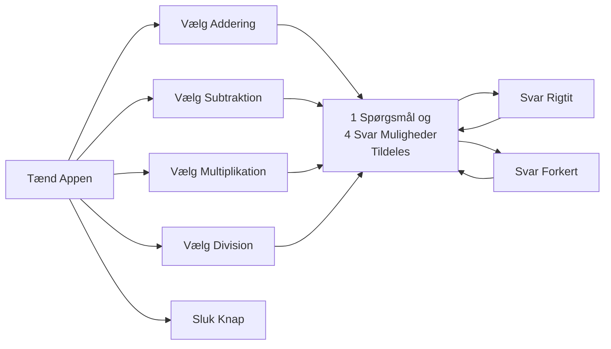

# Matematik Lærings App
I Dette projekt har jeg skulle programmere en lærings app som var bygget op om et designmønster.
Den læringsapp som jeg har valgt at lave, fokuserer på matematiske emne som Addition, subtraktion, mulitplikation, division. Og i min udvikling af appen har jeg brugt factory method til at opbygge funktioner med.

## Flowchart over brugergrænseflade
Min app virker ved at man først starter den, så får man mulighederne for at  vælge imellem Addition, subtraktion, mulitplikation, division og  man får også vedvarende muligheder for at kunne slukke, minimere og maksimere appen( Dog skalere UI'et ikke ved maksimereing og minimering).
Hvis man vælger en af de matematiske emner får man tildelt et spørgsmål og 4 svarmuligheder. hvis man trykker på det rigtige svar får man det at vide og man får igen 4 nye spørgsmål og ligeledes hvis man svarer forkert.

## Design Patterns
Mit valgte designpattern har været "Factory Method". Denne metoder har været god til at splitte et stort kompliceret emne ned i mindre bider som nemt kan vedligeholdes i tilfælde af fremtidige brugerkrav.
