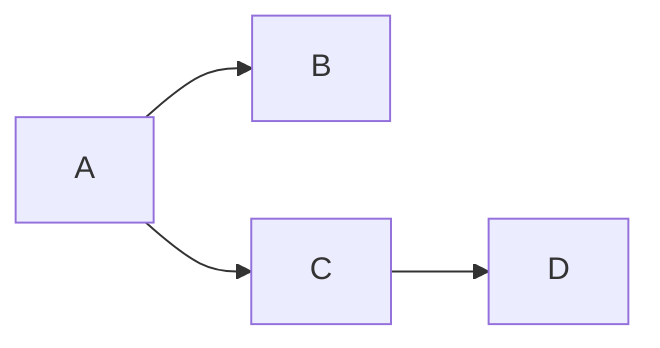

# Matematik Lærings App
Test

## Flowchart over brugergrænseflade

## Design Patterns
Mit valgte designpattern har været "Factory Method". Denne metoder har været god til at splitte et stort kompliceret emne ned i mindre bider som nemt kan vedligeholdes i tilfælde af fremtidige brugerkrav.
